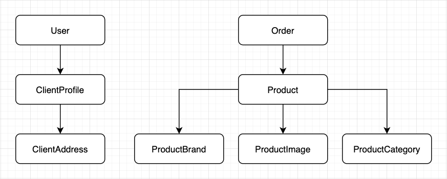

# A Python and Django API Store Example

## Development Installation and Deployment to Docker Swarm

```bash

# Clone de repository
git clone https://github.com/gustavo-fonseca/python-store

# Go to project`s folder and copy .env.example to .env
cd /project-folder
cp .env.example .env

# Run docker-compose and make the initial migrations
docker-compose up -d
docker exec store_backend python manage.py makemigrations
docker exec store_backend python manage.py migrate
docker exec store_backend python manage.py loaddata initial_data.json

# Change the email credentials settings in .env file
# Use sendgrid.net or other smtp service
EMAIL_USE_TLS=True
EMAIL_HOST=smtp.sendgrid.net
EMAIL_HOST_USER=apikey
EMAIL_HOST_PASSWORD=YOUR_KEY
EMAIL_PORT=587

# Change the sentry dns settings in .env file
# https://sentry.io
SENTRY_DNS=https://xxxxxxxx@xxxx.ingest.sentry.io/xxxxx

# Or use email backend console for dev mode in settings.py file
# (Only if the email credentials were not provided)
EMAIL_BACKEND = "django.core.mail.backends.console.EmailBackend"

# Running tests
docker exec store_backend python manage.py test

# Running in development mode
docker exec -it store_backend python manage.py runserver 0:8000

# Deployment to docker swarm
docker stack deploy -c <(docker-compose -f docker-compose-swarm.yml config) store

```


### Running lint based on Google Style Guide
```bash
# install pylint
pip install pylint

# run lint on project
find . -name "*.py" -and -not -name "0*.py" | xargs pylint
```


### API Authentication
```bash

# Login request
curl --location --request POST '{{ api_endpoint }}/login' \
--form 'email=admin@admin.com' \
--form 'password=admin'

# Login response
{
    "token": "received token jwt"
}

# Make authenticated requests
curl --location --request GET '{{ endpoint }}/users' \
--header 'Authorization: JWT {{ token }}' \
--header 'Content-Type: application/json'

```


## Model MindMeister




## Features

All API Store features

### User
- [x] List (filter, search, ordering)
- [x] Read 
- [x] Create 
- [x] Update 
- [x] Delete (Soft)
- [x] Forget password (Send link to email) - You need to create a new user with a valid email address to see this working
- [x] Reset password
- [x] Login
- [x] Token refresh
- [x] Token verify
- [x] Test
- [x] Docs

### Client's Profile
- [x] List (filter, search, ordering)
- [x] Read 
- [x] Create (sign up)
- [x] Update 
- [x] Test
- [x] Docs

### Client's Address
- [x] List (filter, search, ordering)
- [x] Read 
- [x] Create 
- [x] Update 
- [x] Delete (Soft)
- [x] Test
- [x] Docs

### Product's Brand
- [x] List (filter, search, ordering)
- [x] Read 
- [x] Create 
- [x] Update 
- [x] Delete (Soft)
- [x] Test
- [x] Docs

### Product's Category
- [x] List (filter, search, ordering)
- [x] Read 
- [x] Create 
- [x] Update 
- [x] Delete (Soft)
- [x] Test
- [x] Docs

### Product's Image
- [x] List 
- [x] Read 
- [x] Create 
- [x] Update 
- [x] Delete (Soft)
- [x] Test
- [x] Docs

### Product
- [x] List (filter, search, ordering, pagination)
- [x] Read 
- [x] Create 
- [x] Update 
- [x] Delete (Soft)
- [x] Test
- [x] Docs

### Order (Pedido)
- [ ] List (filter, search, ordering)
- [ ] Read 
- [ ] Create 
- [ ] Update 
- [ ] Close
- [ ] Payment
- [ ] Test
- [ ] Docs

### Email Queue
- [ ] Redis queue to send email

### Audit
- [x] Tracking application error (Sentry)
- [ ] Tracking user activity (ELK)

### Payment Method
- [ ] PagSeguro
- [ ] PayPal

### CI/CD
- [ ] Drone CI

### Media/Static files storage
- [ ] AWS S3

### Docker and Swarm
- [x] Dockerize project
- [x] Swarm mode
- [ ] Docker secrets
